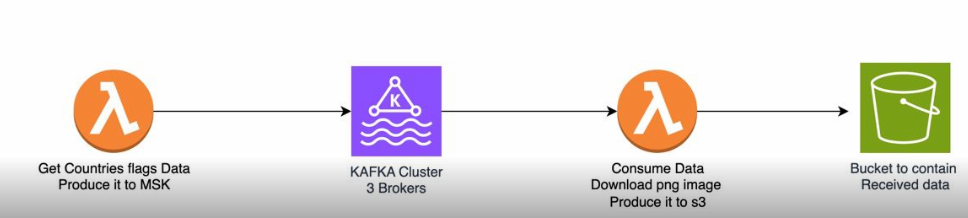

# Streaming data to MSK and consuming into s3
## Description
From the producer side it queries a flags url that outputs contries and their flags int a topic in MSK cluster.
From the consumer side it will read for each country its dictionary then download the flag and save into an s3.

## Prerequisites
In order to able to use this you will need
- AWS Accoun
- Terraform
- Python

## Requirements
Used packages are in requirements.txt Some non supported packaged(by lambda) need to be downloaded locally and then exported to aws as a zip file.

## Design

# Author
Abdelaziz IMGHARNE
imghazizàgmail.com